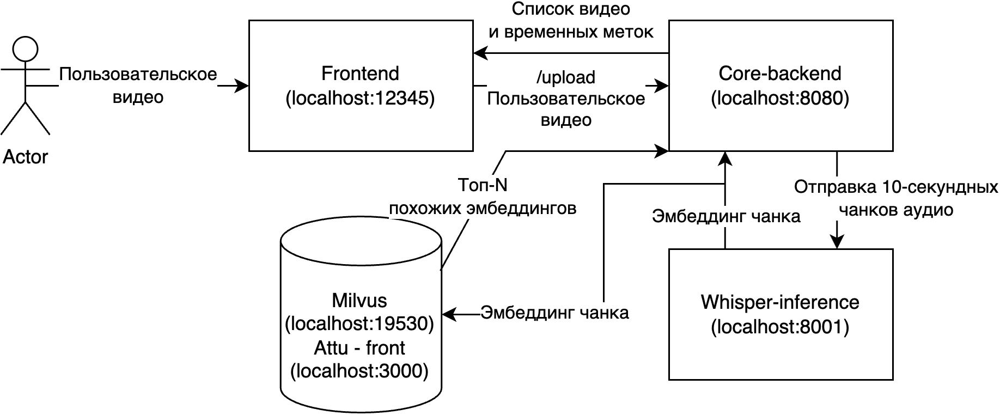

## Инструкция по запуску
1. Необходимо положить файлы тестовых видео в корень репозитория в папку `./videos`
2. Запускаем docker compose up
3. Ждем (5 минут) до полного восстановления базы (смотрим логи milvus-init) и до полного развертывания инференса (логи whisper-inference)
4. Открывем фронтенд на `localhost:12345`

## Описание алгоритма
### Поиск по аудио
Для поиска по аудио используются эмбеддинги 10-секундных чанков с шагом в 1 секунду, построенные с помощью модели Whisper. Для каждого чанка пользовательского видео строится поисковая выдача из топ-N эмбеддингов чанков авторских видео. Затем по этим выдачам строятся пары (отрезок пользовательского видео, отрезок-кандидат авторского видео) с нарушением авторских прав. При построении пары строится цепочка соответствия до тех пор, пока на протяжении 10-ти последних секунд (10 эмбеддингов, 10 выдач) пользовательского видео не будет найдено кандидатов для 10-ти последующих секунд отрезка-кандидата.
### Поиск по видео
По парам отрезков-кандидатов, полученным на предыдущем этапе, извлекаются видео. Затем попарно с шагом в 1 секунду строятся SIFT-признаки кадров пользовательского и авторского видео и рассчитывается сопоставление этих признаков. Таким образом кандидат, полученный на предыдущем этапе либо доуточняется с использованием визуальной информации, либо откидывается как не нарущающий авторские права, если сопоставлений не нашлось.